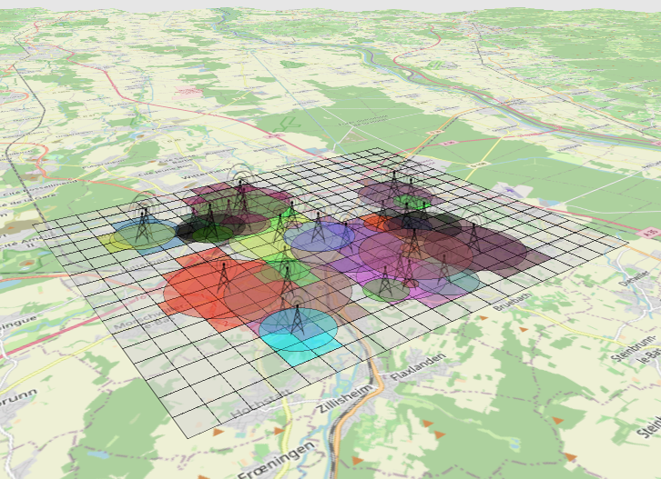

# Projet d'affectation de fréquences pour des antennes


<br />



Ce projet vise à développer un outil d'aide à l'affectation des fréquences à un ensemble d'antennes disposées sur un territoire donné. L'objectif est d'attribuer des fréquences aux antennes de manière à éviter les conflits et à minimiser le nombre total de fréquences utilisées.

## Fonctionnalités clés

- Affectation automatique de fréquences : L'outil permettra d'attribuer automatiquement des fréquences à chaque antenne en évitant les conflits.
- Visualisation des configurations : Les configurations résultantes seront visualisées sur le territoire pour une meilleure compréhension.
- Optimisation des ressources : L'algorithme d'affectation visera à minimiser le nombre total de fréquences utilisées.

## Technologie utilisée

Ce projet est développé en C++. Nous utilisons également QT pour la visualisation des configurations.

## Prérequis pour l'exécution

#### Prétraitement des Données des Antennes

Avant de pouvoir utiliser l'application, il est nécessaire de prétraiter les données des antennes et de les mettre dans un format compatible. Pour ce faire, nous allons créer un fichier CSV contenant les informations suivantes pour chaque antenne :

- Le nom de l'antenne
- Sa position en coordonnées X et Y dans la projection Lambert 93
- Sa puissance d'émission en mètres

#### Format du Fichier CSV

Le fichier CSV aura la structure suivante :

| Nom de l'antenne | Position X | Position Y | Puissance d'émission (en m) |
| ---------------- | ---------- | ---------- | --------------------------- |
| Antenne 1        | 123456     | 123456     | 123456                      |
| Antenne 2        | 123456     | 123456     | 123456                      |
| Antenne 3        | 123456     | 123456     | 123456                      |
| Antenne 4        | 123456     | 123456     | 123456                      |

## Compilation et exécution

- Supprimer le fichier .pro.user
- Ouvrir le fichier .pro avec QtCreator et selectionner le compilateur (MinGW 64-bit)
- Sélectionner le mode "Release" et compiler le projet
- Récupérer le fichier .exe généré
- Placer le fichier .exe dans un dossier contenant le fichier CSV
- Ouvrez un terminal MinGW64 et naviguez vers le dossier contenant le fichier .exe et exécutez la commande suivante :

```bash
windeployqt –release –qmldir <Path> <Exe>
```

- Remplacer `<Path>` par le chemin vers le dossier contenant le fichier .exe
- Remplacer `<Exe>` par le nom du fichier .exe

Si vous êtes sur Linux, vous pouvez utiliser la commande suivante :
https://github.com/probonopd/linuxdeployqt

```bash
linuxdeployqt
```

Si vous êtes sur Mac, vous pouvez utiliser la commande suivante :

```bash
macdeployqt
```
